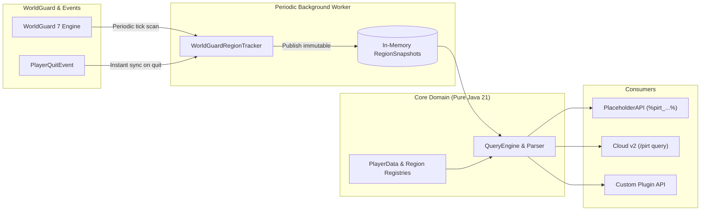

# PIRT — Players In Region Tracker

<p align="center">
  
  
  
  
  
</p>

**PIRT** (*Players In Region Tracker*) is a high-performance, decoupled player-in-region tracking and query engine built for modern Paper Minecraft servers.

---

## The Problem PIRT Solves

In server networks with active scoreboards, tablists, action bars, and menus, plugins frequently evaluate player containment inside WorldGuard regions.

* **Traditional Approach**: Every placeholder request executes a synchronous spatial lookup against WorldGuard's spatial index trees. With multiple regions and dozens of players on the server, this causes noticeable main-thread TPS degradation.
* **The PIRT Solution**: PIRT decouples **data acquisition** from **query evaluation**. A background scheduler periodically captures immutable `RegionSnapshot` records in memory. All PlaceholderAPI requests, commands, and developer queries evaluate in **$O(1)$ constant time** against memory snapshots—delivering zero tick lag.

---

## Architecture at a Glance



---

## Key Features

* ⚡ **Zero-Lag Architecture**: Decoupled in-memory snapshots eliminate WorldGuard spatial tree traversal on placeholder requests.
* 🔍 **Rich Query Engine**: Supports counts, alphabetical rosters, UUID lists, containment checks (`contains`), and targeted player stats.
* 📊 **Mathematical Aggregates**: Perform real-time calculations across region occupants: `max`, `min`, `avg`, and `sum` (e.g. `%pirt_arena_players_avg_health%`).
* 🏷️ **Multi-Word Region Support**: Smart token parsing handles snake_case (`pvp_arena`), kebab-case (`spawn-zone-1`), and dot-separated region IDs automatically.
* 💬 **Incendo Cloud v2 Commands**: Modern command framework with native Paper Brigadier tooltips, async completions, and syntax verification.
* 🧩 **Extensible Developer API**: Register custom `PlayerDataProvider` or `RegionQueryProvider` instances in pure Java.

---

## Quick Start

### Requirements
* **Server**: Paper 1.20+ (or compatible forks)
* **Java**: 21 or newer
* **Dependencies**:
  * [WorldGuard 7](https://enginehub.org/worldguard/) (required for region containment)
  * [PlaceholderAPI](https://www.spigotmc.org/resources/placeholderapi.6245/) (optional, required for `%pirt_...%` placeholders)

### Installation
1. Download the latest `PIRT-x.x.x.jar` release.
2. Place the jar into your server's `plugins/` directory.
3. Start the server. PIRT will automatically detect WorldGuard and register its PlaceholderAPI expansion.
4. Verify the installation:
   ```bash
   /pirt list
   ```

### Quick Placeholder Examples

```
# Player count in 'spawn'
%pirt_spawn_players_count%

# Comma-separated list of players in 'arena'
%pirt_arena_players_names%

# Average health of players in 'pvp_arena'
%pirt_pvp_arena_players_avg_health%

# Check if a player is in the region (returns true/false)
%pirt_arena_players_contains_Steve%

# Target a specific world explicitly
%pirt_world_nether:boss_room_players_count%
```

---

## Documentation

Comprehensive documentation is organized under the [`docs/`](docs/) directory:

| Document | Description |
| :--- | :--- |
| 🏛️ **[Architecture & Mechanics](docs/architecture.md)** | Deep-dive into Hexagonal design, snapshot lifecycles, concurrency, and Mermaid sequence diagrams. |
| 🔤 **[PlaceholderAPI Reference](docs/placeholders.md)** | Full query grammar, supported keys, aggregations, targeted player queries, and formatting. |
| ⚙️ **[Configuration Guide](docs/configuration.md)** | `config.yml` reference, refresh interval tuning, delimiters, and pre-tracking. |
| 💻 **[Commands & Permissions](docs/commands-permissions.md)** | Cloud v2 command reference, Brigadier integration, and permission nodes. |
| 🛠️ **[Developer API Guide](docs/developer-api.md)** | Integrating PIRT via Gradle/Maven, registering custom data providers, and executing programmatic queries. |

---

## Building from Source

PIRT uses Gradle with the Kotlin DSL. To build the plugin shadow jar:

```bash
# Clone the repository
git clone https://github.com/DarkBladeDev/PIRT.git

# Build with Gradle wrapper
./gradlew clean shadowJar
```

The resulting compiled plugin will be located at:
```
pirt-platform-paper/build/libs/PIRT-1.2.0-SNAPSHOT.jar
```

To run all unit tests:
```bash
./gradlew test
```

---

## Changelog

See [CHANGELOG.md](CHANGELOG.md) for version release notes and migration guides.

---

## Author & License

* **Author**: DarkBladeDev
* **License**: MIT
