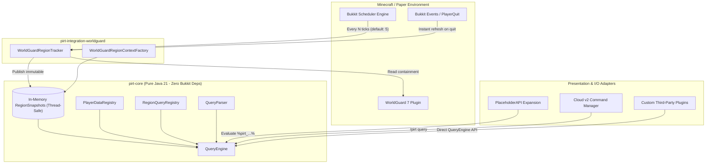
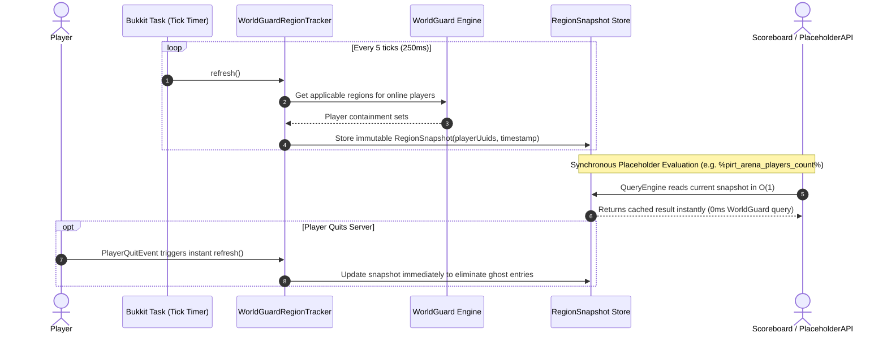

# Architecture & Mechanics

PIRT (**Players In Region Tracker**) is architectured from the ground up to solve a fundamental scalability problem in Minecraft servers: **high-frequency region polling causes server lag**.

Traditional setups that parse placeholders or queries across scoreboards, action bars, tablists, and menus make synchronous spatial lookups against WorldGuard's spatial index tree on every query. When dozens of players and regions are queried multiple times a second, main thread tick time spikes significantly.

PIRT decouples **data acquisition** from **query execution** using a **Hexagonal (Ports and Adapters)** architecture.

---

## High-Level Architecture Overview

---

## Module Breakdown

PIRT is structured into four distinct modules:

| Module | Responsibility | Dependencies |
| :--- | :--- | :--- |
| `pirt-core` | Pure domain model: `QueryEngine`, `QueryParser`, `RegionSnapshot`, `PlayerDataRegistry`, and `RegionQueryRegistry`. | **None** (Pure Java 21, no Bukkit/Spigot/Paper or WorldGuard dependencies). |
| `pirt-integration-worldguard` | WorldGuard adapter: spatial containment checking, region discovery, and tracker worker. | `pirt-core`, WorldGuard 7 Core, Bukkit API. |
| `pirt-integration-placeholderapi` | I/O presentation adapter: translates raw `%pirt_<query>%` strings into structured queries and formats outputs. | `pirt-core`, PlaceholderAPI. |
| `pirt-platform-paper` | Application entrypoint: plugin lifecycle, Incendo Cloud v2 command registration, configuration, and Paper player data providers. | `pirt-core`, `pirt-integration-worldguard`, `pirt-integration-placeholderapi`, Paper API, Cloud v2. |

---

## How It Works: The Snapshot Lifecycle

Instead of evaluating WorldGuard's spatial indexes synchronously when a placeholder or command is run, PIRT maintains an in-memory cache of **immutable `RegionSnapshot` records**.

### 1. Background In-Memory Acquisition
* A background Bukkit task executes `WorldGuardRegionTracker#refresh()` at a configurable tick interval (default: `5` ticks = 250ms).
* The tracker interrogates WorldGuard for all online players and groups them by their containing regions.
* The results are packaged into immutable `RegionSnapshot` records and stored in a thread-safe map.

### 2. Instant Zero-Latency Queries ($O(1)$)
* When PlaceholderAPI, a command, or another plugin queries PIRT (e.g., `%pirt_spawn_players_count%`), the `QueryEngine` does **not** query WorldGuard.
* It directly accesses the in-memory `RegionSnapshot`, resolving counts, player lists, or player attributes in constant or linear in-memory time ($O(1)$ to $O(N)$ where $N$ is only the number of players inside the region).

### 3. Event-Driven Quit Compensation
* If a player disconnects, `PlayerQuitEvent` triggers an immediate synchronous snapshot update via `regionTracker.refresh()`.
* This guarantees that player counts and lists remain perfectly accurate even before the next scheduled tick refresh.

---

## Query Engine Parsing & Scored Candidate Matching

One of PIRT's standout architectural features is its resilient **`QueryParser`**. Region names in WorldGuard can include underscores (`_`), hyphens (`-`), numbers, or mixed formats (e.g. `pvp_arena_nether-1`).

To prevent ambiguity when parsing strings like `%pirt_pvp_arena_players_count%`, the `QueryParser` implements a **priority-scored candidate matching algorithm**:

1. **Candidate Splitting**: The parser identifies every possible split boundary (`_`, `-`, `.`).
2. **Operation Matching**: Each suffix is evaluated against standard operations (`players_count`, `players_names`, aggregates like `players_max_health`, etc.) and assigned a priority score.
3. **Environment Confirmation**: The region candidate is checked against the runtime environment via `RegionExistenceChecker`. If the region exists in WorldGuard, it receives a $+1000$ priority score bonus.
4. **Best Match Selection**: The candidate with the highest overall score is selected and dispatched to the `QueryEngine`.
